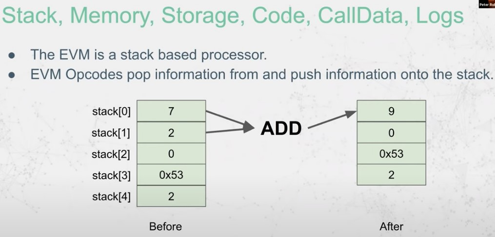

# EVM

## BASICS



The Ethereum Virtual Machine (EVM) is a computation engine that executes smart contracts on EVM-compatible blockchains using a stack-based architecture and a turing-complete instruction set.

EVM does use several data regions:

### Data Region - The Code

_Note: basic computer equivalent = .CODE/.TEXT segment_

In the Code region, the instructions of the smart contracts are defined. Almost all of those instructions are taking their parameters from another data region: the Stack.

EVM does use its own instructions, which are defined here: https://www.evm.codes/

### Data Region - The Program Counter

_Note: basic computer equivalent = EIP register_

The Program Counter is used to encode which instruction should be next executed. It points to the code section.

### Data Region - The Stack

_Note: basic computer equivalent = stack segment_

In EVM, the stack is a list of 32-byte element. Each call has its own stack, which is destroyed when the call context ends.

The stack does follow a LIFO structure (Last-In First Out).

### Data Region - The Memory

_Note: basic computer equivalent = heap segment_

The memory region is not persistent, it is also destroyed at the end of the call context.

Memory is accessible using `MSTORE` and `MLOAD` instructions.

### Data Region - The Storage

_Note: basic computer equivalent = data segment, but always persistent for each execution of contract_

This is a map of $2^{256}$ slots of 32-byte values. It is the persistent memory of contracts.

Storage is accessible using `SSTORE` and `SLOAD` instructions.

### Data Region - The Calldata

_Note: basic computer equivalent = argc/argv, but instead of commandline, it is transaction_

This is the data sent to a smart contract through a transaction. The function selector will be in this calldata.

This calldata is accessible using `CALLDATALOAD`, `CALLDATASIZE` and `CALLDATACOPY`.

### Data Region - The return data

_Note: basic computer equivalent = return value_

This is the data returned from a smart contract once execution is done.

A contract access to it using `RETURN` or `REVERT` instructions. It can be read from a calling contract through `RETURNDATASIZE` and `RETURNDATACOPY`.

<br>
<br>

## CONTRACT CREATION CODE

**Key Concepts:**

- Deployment data layout: `<init code> <runtime code> <constructor parameters>` (as a convention). Together they’re called the **creation code;**
- Init code is executed first, storing runtime code on the blockchain;
- `creationCode`: Retrieves bytecode for deployment, excluding constructor arguments.

<br>

_Example._ Retrieving creationCode:

```solidity
contract GetCreationCode {
    function get() external pure returns (bytes memory) {
        return type(ValueStorage).creationCode;
    }
}
```

### INIT CODE Breakdown

#### Payable Constructor Example:

- Init Code: `(0x)6080604052603f8060116000396000f3fe`
- Process:
  - Allocate memory;
  - Copy runtime code;
  - Return runtime code for storage.

#### Non-Payable Constructor Example:

- Init Code: Contains additional 12 bytes to handle wei checks and revert if necessary;
- Wei Check Opcodes:
  - Verify no wei sent: `CALLVALUE`, `ISZERO`, `REVERT`.

#### Key Differences:

- Payable Offset: 0x11;
- Non-Payable Offset: 0x1d (12-byte adjustment).

<br>
<br>

### RUNTIME CODE Breakdown

#### Runtime code for an empty contract

- Even an empty contract has non-empty runtime code due to compiler-added metadata;
- Solidity appends metadata to runtime code, with an INVALID opcode (fe) prepended to prevent execution;
- From Solidity 0.8.18, `--no-cbor-metadata` prevents metadata addition;
- Pure Yul contracts do not include metadata by default unless explicitly added.

<br>

Example Yul contract copies and returns runtime code without metadata:

```julia
// The output of the compilation of this contract will have no metadata by default

object "Simple" {
 code {
     datacopy(0, dataoffset("runtime"), datasize("runtime"))
     return(0, datasize("runtime"))
 }

 object "runtime" {

     code {
         mstore(0x00, 2)
         return(0x00, 0x20)
     }
 }
}
```

Compilation output: `6000600d60003960006000f3fe`.

#### Non-Empty Contract Runtime Code

Adding minimal logic to a contract changes the runtime and metadata:

```solidity
pragma solidity 0.8.7;

contract Runtime {
    address lastSender;
    constructor () payable {}

    receive() external payable {
        lastSender = msg.sender;
    }
}
```

- Constructor arguments are ABI-encoded and appended to creation code;
- Solidity ensures parameter length matches expectations, reverting if not;
- Runtime code, metadata, free memory pointer, and constructor argument are organized in memory before the `RETURN` opcode executes;
- Metadata resides in unexecutable sections.

<br>

**<u>Steps in Constructor Handling:</u>**

**1.** Initialize Free Memory Pointer

- Standard initialization using 6080604052.

**2.** Calculate Parameter Length

- Use CODESIZE and subtraction to determine appended parameter length.

**3.** Copy Constructor Parameters

- Use CODECOPY to place parameters in memory.

**4.** Update Free Memory Pointer

- Adjust pointer after copying parameters.

**5.** SSTORE Execution

- Store parameter in contract storage (e.g., slot 0).

**6.** Validate Parameter Size

- Ensure parameter is at least 32 bytes, reverting otherwise.

**7.** Return Runtime Code

- Copy runtime code to memory and return it.

<br>
<br>

## CHOOSING A FUNCTION SELECTOR

**Key Concepts:**

- Code-to-Interpretation Flow: `Solidity → Yul → Bytecode (Runtime) → Opcodes`;
- Opcodes = 1 byte long, approximately 250 opcodes;
- Function selectors are the first 4 bytes of the Keccak-256 hash of a function's canonical representation (e.g., store(uint256) → 6057361d);
- Calldata includes:
  - The 4-byte function selector,
  - 32-byte arguments.

### Function Selector Logic in Bytecode

1. Extracts the selector by shifting the first 4 bytes of calldata;
2. Compares the selector with predefined selectors in the bytecode using opcodes like `EQ`;
3. Uses conditional jumps (`JUMPI`) to move to the corresponding function's bytecode location.

<br>

_Example:_

For `store(10)`, calldata is:
`6057361d000000000000000000000000000000000000000000000000000000000000000a`

- `6057361d`: Function selector for `store(uint256)`.
- `000...0a`: Encoded argument (10).

The bytecode checks the selector and jumps to the correct location in the program.

<br>

**Key Opcodes in Function Selection:**

- `PUSH1`, `PUSH2`, `PUSH4`: Push byte-specific (1/2/4 bytes of data) data onto the stack;
- `CALLDATALOAD`: Load calldata at a specified offset;
- `SHR`: Bit-shift data to isolate the function selector;
- `JUMPI`: Conditionally jump to a function's bytecode based on selector match.

<br>
<br>
